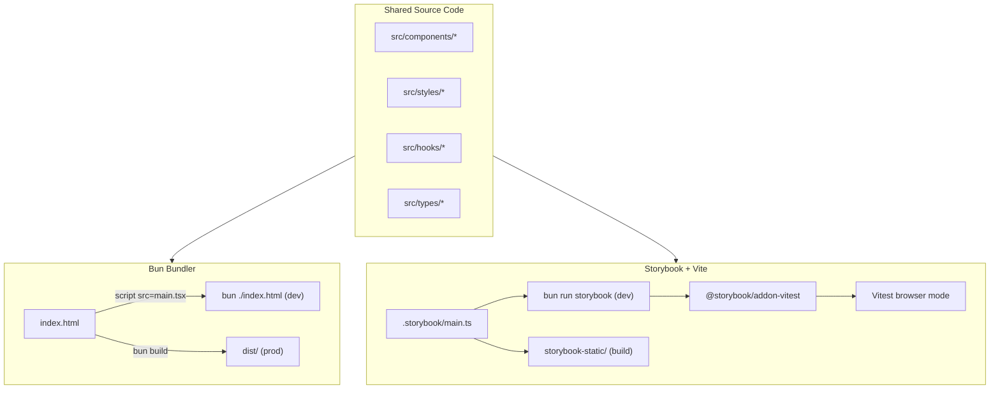
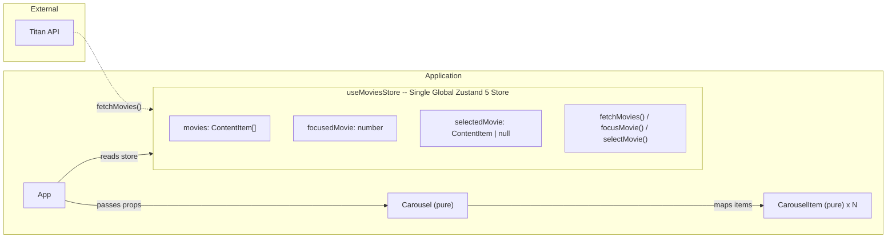
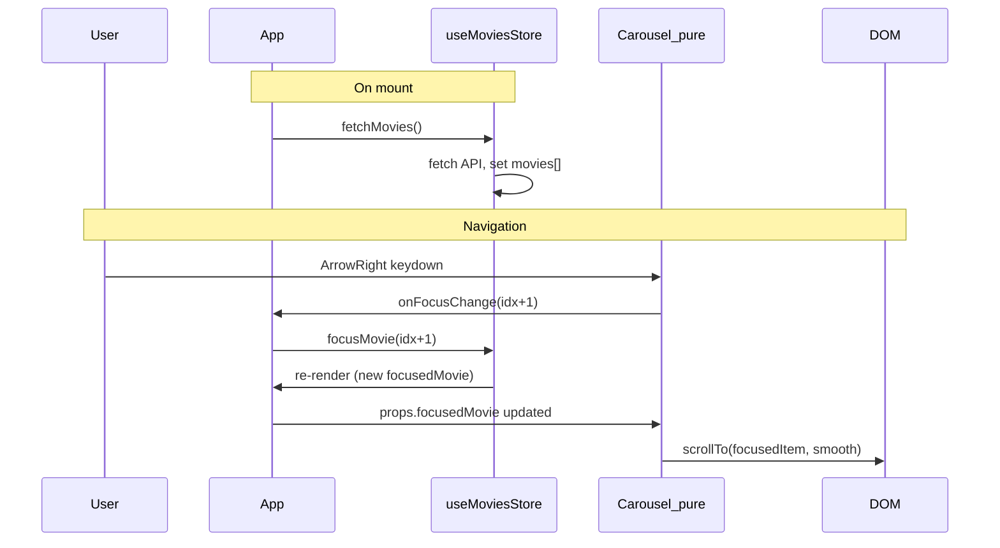

# Titan Horizontal List -- Project Plan

## Version Pinning (February 2026)


| Tool       | Version | Key Fact                                                 |
| ---------- | ------- | -------------------------------------------------------- |
| Bun        | 1.3.8   | Bundler with HTML entry, CSS Modules, HMR, dev server    |
| React      | 19.2.4  | `ref` as prop, `<Context>` as provider, `use()` hook     |
| Zustand    | 5.0.11  | `useShallow` mandatory, single global `create()` store   |
| Storybook  | 10.2.1  | ESM-only, `@storybook/addon-vitest` replaces test-runner |
| Vitest     | >= 3.0  | Browser mode via Playwright, Storybook integration       |
| Playwright | latest  | E2E + visual regression + Vitest browser provider        |


## Dual Bundler Strategy

The app uses **two bundlers** for two different purposes:


| Concern                                 | Tool                                   | Entry            | Why                                                      |
| --------------------------------------- | -------------------------------------- | ---------------- | -------------------------------------------------------- |
| **Main app** (dev + prod)               | **Bun bundler**                        | `index.html`     | Zero-config, fast HMR (~6ms), native CSS Modules, TS/JSX |
| **Storybook** (component dev + testing) | **Vite** (via `@storybook/react-vite`) | Storybook config | Storybook 10 requires Vite internally                    |


Both share the same `src/` source code. No duplication.




## Architecture Overview

Single global Zustand store holds **all** state (data + UI). Components are pure/functional -- they receive data and callbacks via props, no store coupling inside.







## Component Breakdown

- **useMoviesStore** (`src/stores/useMoviesStore.ts`) -- single global Zustand 5 store created with `create()`. Holds `movies[]`, `focusedMovie`, `selectedMovie`, and actions `fetchMovies()`, `focusMovie(idx)`, `selectMovie(movie)`.
- **App** -- reads store via `useMoviesStore`, calls `fetchMovies()` on mount, passes data + callbacks as props to Carousel. Renders "TitanTest" title + black background.
- **Carousel** -- **pure functional component**. Props: `movies`, `focusedMovie`, `onFocusChange`. Handles keyboard events, calls `onFocusChange(newIndex)`. Calls `scrollTo` on `focusedMovie` change.
- **CarouselItem** -- **pure functional component**. Props: `movie`, `isFocused`, `onSelect`. Renders poster image, `data-focused` attribute.

## File Structure

```
index.html                    # Bun bundler entry point
src/
  main.tsx                    # React 19 createRoot, imports globals.css
  App.tsx                     # Reads store, passes props to Carousel
  App.module.css              # Full-screen black background, title styling
  styles/
    reset.css                 # Modern CSS reset
    tokens/
      colors.css              # --color-bg, --color-surface, --color-focus-ring
      spacing.css             # --spacing-xs through --spacing-2xl
      typography.css           # --font-family, --font-size-*
    globals.css               # @import tokens + reset + body defaults
  stores/
    useMoviesStore.ts         # Single global Zustand 5 store (data + UI state)
  components/
    Carousel/
      Carousel.tsx            # Pure component: movies, focusedMovie, onFocusChange
      Carousel.module.css
      Carousel.stories.tsx
      CarouselItem.tsx         # Pure component: movie, isFocused, onSelect
      CarouselItem.module.css
      CarouselItem.stories.tsx
  types/
    api.ts                    # ContentItem, ApiResponse
tests/
  e2e/
    carousel.e2e.spec.ts      # Playwright E2E against Storybook iframe
  visual/
    visual-regression.spec.ts  # Playwright screenshot comparison
.storybook/
  main.ts                     # ESM, @storybook/react-vite, addon-vitest
  preview.ts                  # globals.css import, decorators
  vitest.setup.ts             # setProjectAnnotations for Vitest addon
vitest.config.ts              # Storybook Vitest plugin + browser mode
playwright.config.ts          # E2E + visual regression config
tsconfig.json                 # Bun reads this for path aliases + JSX config
```

## Key Decisions

- **Single global store**: One `useMoviesStore` created with `create()` holds everything -- `movies[]`, `focusedMovie`, `selectedMovie`, plus actions. No Context, no Provider wrapper. Only `App` reads the store; all child components are pure.
- **Pure functional components**: `Carousel` and `CarouselItem` take props only (`movies`, `focusedMovie`, `onFocusChange`, `onSelect`). No store coupling. Easy to test in Storybook -- just pass mock data as args.
- **Bun as app bundler**: `bun ./index.html` for dev, `bun build ./index.html --outdir=dist --minify` for prod. Storybook uses Vite internally.
- **React 19 idioms**: `ref` as prop (no `forwardRef`), `preconnect()` for API domain
- **Zustand 5 idioms**: `create<T>()(...)` curried syntax, `useShallow` for multi-value selectors, State/Actions interface split
- **Storybook 10 idioms**: ESM-only, `@storybook/addon-vitest` (not test-runner), play functions + `fn()` spies for interaction tests
- **No scroll-snap**: Programmatic `scrollTo({ behavior: 'smooth' })` to pin focused item leftmost
- **No classnames/clsx**: Template literals for conditional classes
- **No navigation libraries**: Simple `keydown` listener for ArrowLeft/ArrowRight
- **CSS Modules + BEM + tokens**: `.item--focused`, `var(--color-focus-ring)`, dark theme
- **App UI**: Black background, "TitanTest" title in Netflix-red at top, carousel below

