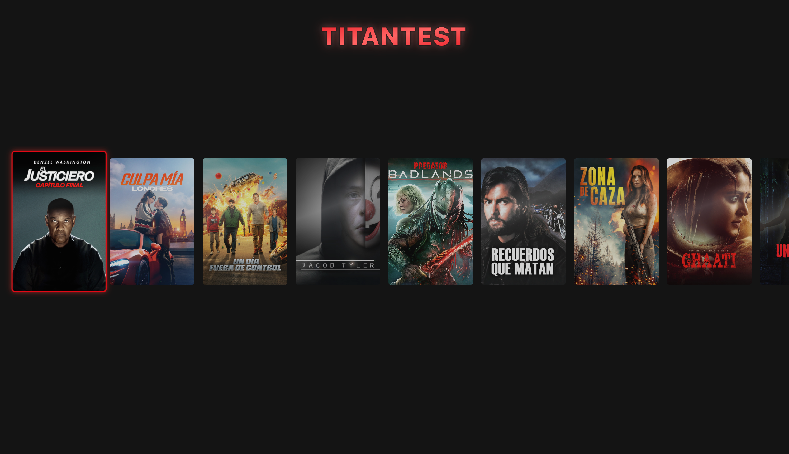
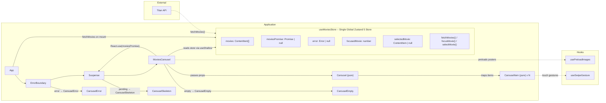
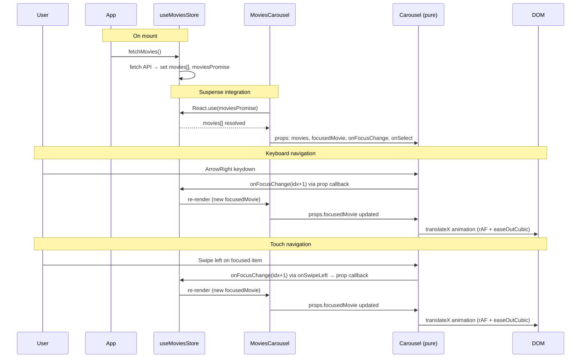

# Titan Horizontal List



[Live Demo](https://brunomolteni.github.io/titan-test/)

A Netflix/Kodi-style horizontal carousel navigable with keyboard arrows. Built with React 19, Zustand 5, CSS Modules, Storybook 10, Vitest, and Playwright.

## Overview

This project implements a horizontal carousel component that displays movies in a scrollable list. Users can navigate through items using keyboard arrow keys, with smooth scrolling and focus management. The application fetches movie data from the Titan API and displays it in an interactive carousel interface.

## Demo

- [Desktop Recording](https://github.com/brunomolteni/titan-test/raw/refs/heads/main/recordings/desktop.mov)
- [Mobile Recording](https://github.com/brunomolteni/titan-test/raw/refs/heads/main/recordings/mobile.mov)

## Setup

### Prerequisites

- [Bun](https://bun.sh) (recommended) or Node.js 18+
- A modern web browser

### Installation

Install dependencies using Bun (recommended) or npm:

```bash
bun install
```

Or with npm:

```bash
npm install
```

## Development

### Running the App

Start the development server for the main application:

```bash
bun run dev
```

Or with npm:

```bash
npm run dev
```

The app will be available at `http://localhost:5173` (or the port shown in the terminal).

### Running Storybook

Start Storybook for component development and testing:

```bash
bun run storybook
```

Or with npm:

```bash
npm run storybook
```

Storybook will be available at `http://localhost:6006`.

### Building

Build the production app:

```bash
bun run build
```

Build Storybook for static deployment:

```bash
bun run build-storybook
```

## Testing

### Unit Tests (Vitest)

Run unit tests via Storybook:

```bash
bun run test
```

### E2E Tests (Playwright)

Run end-to-end tests:

```bash
bun run test:e2e
```

### Visual Regression Tests

Run visual regression tests:

```bash
bun run test:visual
```

## Features

- **Keyboard Navigation**: Navigate through carousel items using arrow keys
- **Smooth Scrolling**: Automatic smooth scrolling to focused items
- **Touch Support**: Swipe gestures for mobile devices
- **Image Preloading**: Optimized image loading for better performance
- **Pure Components**: All components are pure functions, easy to test
- **Type Safety**: Full TypeScript support throughout
- **Component Documentation**: Storybook stories with interaction tests

## Tech Stack

- **React 19** - UI library with latest features
- **Zustand 5** - Lightweight state management
- **CSS Modules** - Scoped styling with BEM methodology
- **Storybook 10** - Component development and documentation
- **Vitest** - Fast unit testing framework
- **Playwright** - E2E and visual regression testing
- **Vite** - Fast build tool and dev server

## File Structure

```
src/
  components/
    Carousel/
      __mocks__/movies.ts       # Mock data for tests/stories
      Carousel.tsx              # Main carousel with keyboard nav & animation
      Carousel.module.css
      Carousel.stories.tsx
      CarouselItem.tsx           # Individual movie card with swipe support
      CarouselItem.module.css
      CarouselItem.stories.tsx
      CarouselEmpty.tsx          # Empty state ("no movies")
      CarouselEmpty.module.css
      CarouselEmpty.stories.tsx
      CarouselError.tsx          # Error state with retry button
      CarouselError.module.css
      CarouselError.stories.tsx
      CarouselSkeleton.tsx       # Loading skeleton placeholder
      CarouselSkeleton.module.css
      CarouselSkeleton.stories.tsx
    ErrorBoundary.tsx            # React error boundary (class component)
  hooks/
    usePreloadImages.ts          # Preloads poster images
    useSwipeGesture.ts           # Touch swipe detection with throttling
  stores/
    useMoviesStore.ts            # Single global Zustand 5 store
  styles/
    globals.css                  # Imports reset + tokens
    reset.css                    # CSS reset
    tokens/
      colors.css                 # Color design tokens
      spacing.css                # Spacing design tokens
      typography.css             # Typography design tokens
  types/
    api.ts                       # ContentItem, ApiResponse interfaces
  App.tsx                        # Root component
  App.module.css
  main.tsx                       # Entry point
tests/
  e2e/                           # Playwright end-to-end tests
  visual/                        # Visual regression tests
.storybook/                      # Storybook configuration
```

## Architecture Overview

Single global Zustand store holds **all** state (data + UI). `App` calls `fetchMovies()` on mount. A `MoviesCarousel` wrapper reads the store and uses `React.use()` to integrate with Suspense for loading states. The actual `Carousel` and `CarouselItem` components are pure -- they receive data and callbacks via props only.



## Component Flow



## Component Breakdown

- **useMoviesStore** (`src/stores/useMoviesStore.ts`) -- single global Zustand 5 store created with `create()`. Holds `movies[]`, `moviesPromise`, `error`, `focusedMovie`, `selectedMovie`, and actions `fetchMovies()`, `focusMovie(idx)`, `selectMovie(movie)`.
- **App** (`src/App.tsx`) -- calls `fetchMovies()` on mount. Wraps content in `ErrorBoundary` + `Suspense` to handle error/loading states. Delegates store reading to `MoviesCarousel`.
- **MoviesCarousel** (inner component in `src/App.tsx`) -- reads the store via `useShallow`, calls `React.use(moviesPromise)` to suspend while loading. Renders `CarouselEmpty` when no movies, otherwise renders `Carousel` with props.
- **Carousel** (`src/components/Carousel/Carousel.tsx`) -- **pure functional component**. Props: `movies`, `focusedMovie`, `onFocusChange`, `onSelect`. Handles keyboard events (ArrowLeft/Right, throttled), animates scroll via `translateX` with `requestAnimationFrame` and easeOutCubic easing.
- **CarouselItem** (`src/components/Carousel/CarouselItem.tsx`) -- **pure functional component**. Props: `movie`, `isFocused`, `onSelect`, `onSwipeLeft`, `onSwipeRight`. Renders poster image with fallback placeholder. Uses `useSwipeGesture` for touch navigation on focused items.
- **CarouselSkeleton** (`src/components/Carousel/CarouselSkeleton.tsx`) -- loading placeholder rendered by Suspense while `moviesPromise` is pending.
- **CarouselEmpty** (`src/components/Carousel/CarouselEmpty.tsx`) -- empty state shown when API returns no movies.
- **CarouselError** (`src/components/Carousel/CarouselError.tsx`) -- error state with retry button, rendered by `ErrorBoundary` fallback.
- **ErrorBoundary** (`src/components/ErrorBoundary.tsx`) -- class component catching render errors, displays `CarouselError` and supports reset/retry.
- **usePreloadImages** (`src/hooks/usePreloadImages.ts`) -- preloads poster images into the browser cache, tracks failed URLs.
- **useSwipeGesture** (`src/hooks/useSwipeGesture.ts`) -- detects horizontal touch swipe gestures with configurable threshold, vertical rejection, and built-in throttling.

## Q&A

### Frontend Architecture & State Management

**Q: Describe how you would architect the frontend to handle complex state (user preferences, content data, navigation focus) across multiple screen types and input methods. How would you structure your components and manage data flow as users navigate with remote controls?**

A global state management solution that can be directly imported and used by components (e.g. a Zustand store) provides one-way data flow and centralized actions, avoiding unnecessary re-renders. Components are presentational for the most part -- they receive data and callbacks via props. Page-level components are "smart" in that they access external stores via hooks and pass down props and handlers to presentational components.

### Performance & Data Loading

**Q: How would you optimize the frontend for smooth performance when displaying thousands of content tiles with images and metadata? Discuss your approach to lazy loading, caching, and memory management for resource-constrained CTV devices.**

There are many options depending on the particular aspect to optimize, but general good practices include:

- **Load the least amount of data necessary** for above-the-fold content and lazy load below the fold. GraphQL endpoints are ideal for this since clients request only the fields they need.
- **Progressive image loading** -- start with low-resolution placeholders and upgrade to high-resolution when visible, using native APIs like `IntersectionObserver`.
- **Virtualized lists** -- use virtualization to support thousands of items on screen by only rendering what is visible at any given time.
- **Service worker cache layer** -- avoid stale data loading by separating content that rarely changes from content that updates frequently, with configurable caching strategies.
- **Persistence layer** using `localStorage` or `IndexedDB` for faster second-visit loading.

