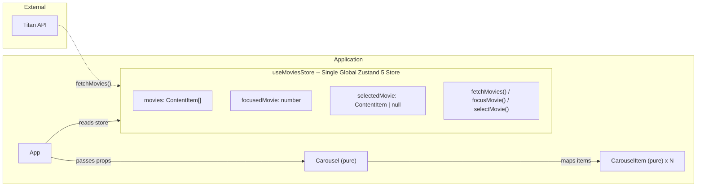
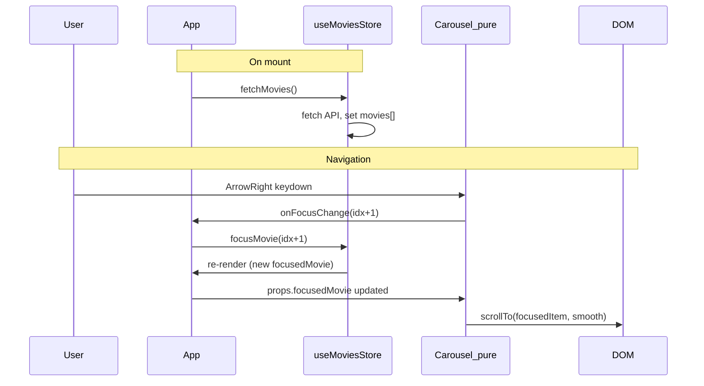

# Titan Horizontal List

A Netflix/Kodi-style horizontal carousel navigable with keyboard arrows. Built with React 19, Zustand 5, CSS Modules, Storybook 10, Vitest, and Playwright.

## Overview

This project implements a horizontal carousel component that displays movies in a scrollable list. Users can navigate through items using keyboard arrow keys, with smooth scrolling and focus management. The application fetches movie data from the Titan API and displays it in an interactive carousel interface.

## Setup

### Prerequisites

- [Bun](https://bun.sh) (recommended) or Node.js 18+
- A modern web browser

### Installation

Install dependencies using Bun (recommended) or npm:

```bash
bun install
```

Or with npm:

```bash
npm install
```

## Development

### Running the App

Start the development server for the main application:

```bash
bun run dev
```

Or with npm:

```bash
npm run dev
```

The app will be available at `http://localhost:5173` (or the port shown in the terminal).

### Running Storybook

Start Storybook for component development and testing:

```bash
bun run storybook
```

Or with npm:

```bash
npm run storybook
```

Storybook will be available at `http://localhost:6006`.

### Building

Build the production app:

```bash
bun run build
```

Build Storybook for static deployment:

```bash
bun run build-storybook
```

## Testing

### Unit Tests (Vitest)

Run unit tests via Storybook:

```bash
bun run test
```

### E2E Tests (Playwright)

Run end-to-end tests:

```bash
bun run test:e2e
```

### Visual Regression Tests

Run visual regression tests:

```bash
bun run test:visual
```

## Features

- **Keyboard Navigation**: Navigate through carousel items using arrow keys
- **Smooth Scrolling**: Automatic smooth scrolling to focused items
- **Touch Support**: Swipe gestures for mobile devices
- **Image Preloading**: Optimized image loading for better performance
- **Pure Components**: All components are pure functions, easy to test
- **Type Safety**: Full TypeScript support throughout
- **Component Documentation**: Storybook stories with interaction tests

## Tech Stack

- **React 19** - UI library with latest features
- **Zustand 5** - Lightweight state management
- **CSS Modules** - Scoped styling with BEM methodology
- **Storybook 10** - Component development and documentation
- **Vitest** - Fast unit testing framework
- **Playwright** - E2E and visual regression testing
- **Vite** - Fast build tool and dev server

## File Structure

```
src/
  components/          # React components
  hooks/               # Custom React hooks
  stores/              # Zustand state stores
  styles/              # Global styles and design tokens
  types/               # TypeScript type definitions
tests/
  e2e/                 # Playwright end-to-end tests
  visual/              # Visual regression tests
.storybook/            # Storybook configuration
```

## Architecture Overview

Single global Zustand store holds **all** state (data + UI). Components are pure/functional -- they receive data and callbacks via props, no store coupling inside.



## Component Flow



## Component Breakdown

- **useMoviesStore** (`src/stores/useMoviesStore.ts`) -- single global Zustand 5 store created with `create()`. Holds `movies[]`, `focusedMovie`, `selectedMovie`, and actions `fetchMovies()`, `focusMovie(idx)`, `selectMovie(movie)`.
- **App** -- reads store via `useMoviesStore`, calls `fetchMovies()` on mount, passes data + callbacks as props to Carousel. Renders "TitanTest" title + black background.
- **Carousel** -- **pure functional component**. Props: `movies`, `focusedMovie`, `onFocusChange`. Handles keyboard events, calls `onFocusChange(newIndex)`. Calls `scrollTo` on `focusedMovie` change.
- **CarouselItem** -- **pure functional component**. Props: `movie`, `isFocused`, `onSelect`. Renders poster image, `data-focused` attribute.

